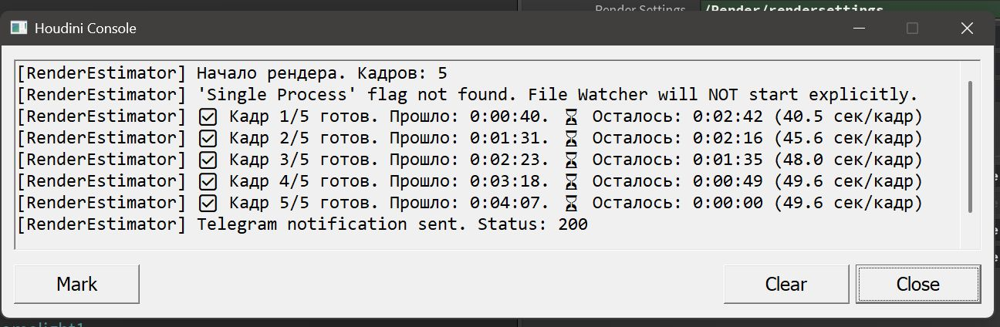
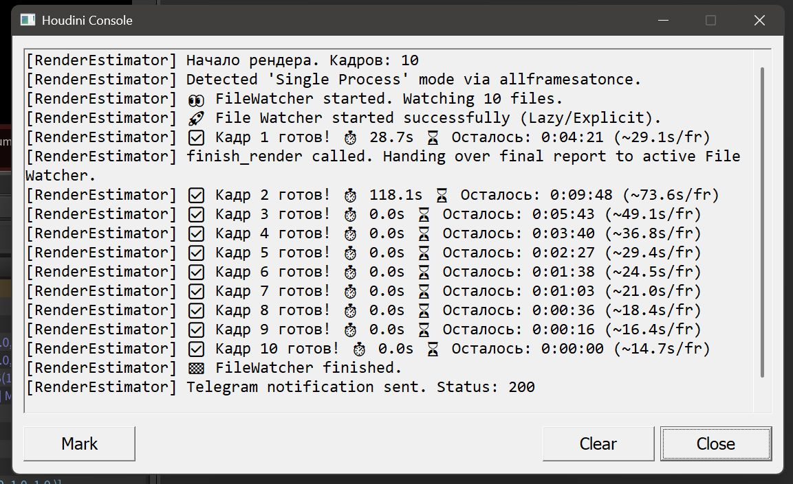
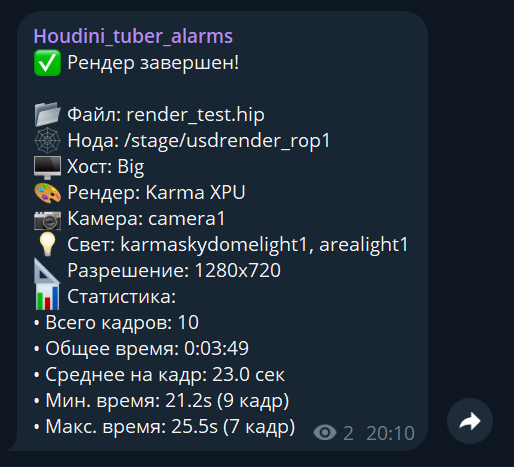
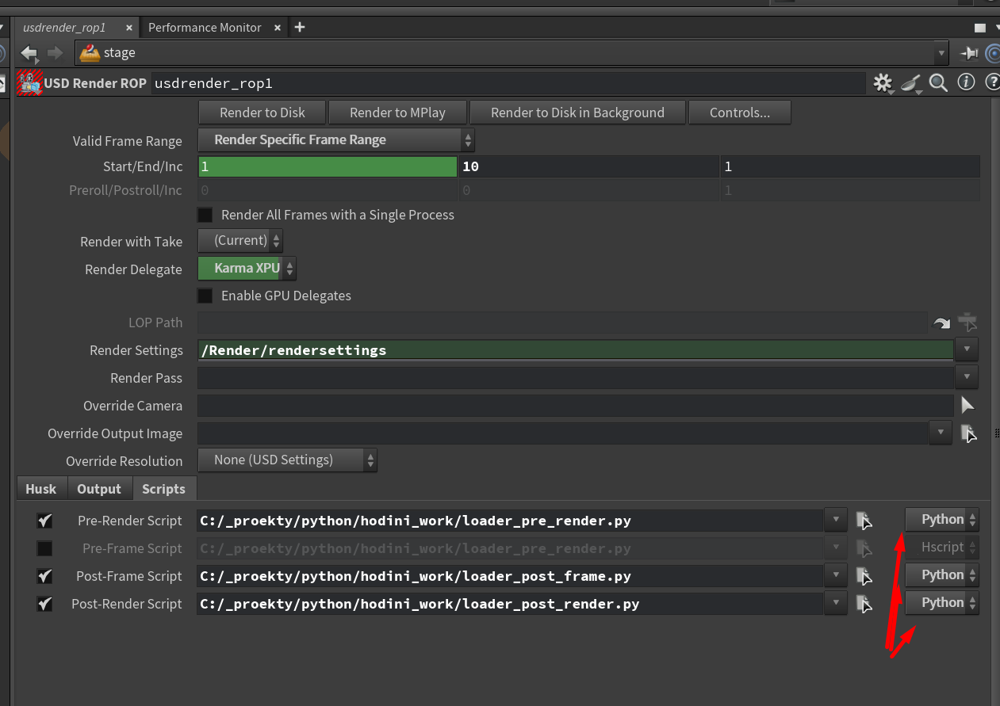
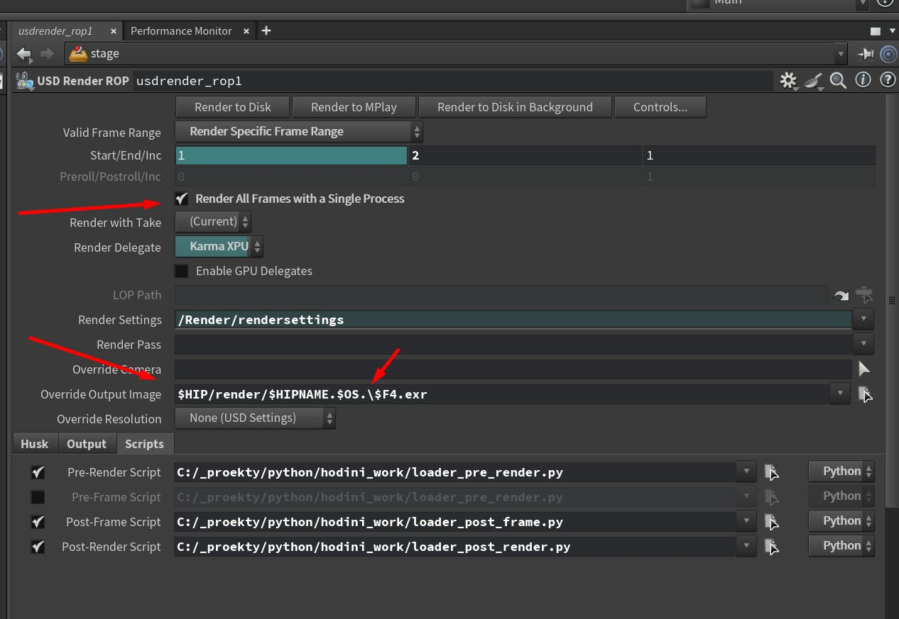
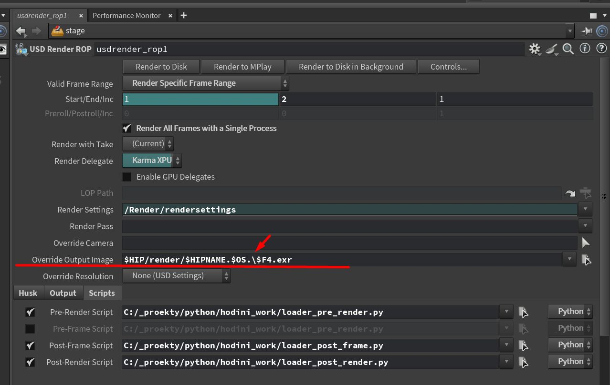

🇷🇺 [Русский](README.md) | 🇬🇧 [English](README_en.md)

# Houdini Render Estimator & Telegram Notifier

Этот набор скриптов для Houdini позволяет оценивать время рендера и отправлять уведомления в Telegram по завершению задачи.

Скрипт автоматически собирает статистику рендера (время на кадр, общее время, разрешение, камеру, источники света) и отправляет красивый отчет прямо в ваш чат.

## ✨ Возможности

### 1. Оценка времени и Прогресс
*   **Статус-бар**: Показывает текущий кадр, прошедшее время и *прогноз* оставшегося времени прямо в статус-баре Houdini.
*   **Консоль**: Выводит подробную информацию в консоль Houdini после каждого кадра.




### 2. Telegram Уведомления
После завершения рендера вы получаете сообщение с детальным отчетом:



*   **📂 Файл**: Имя HIP файла.
*   **🕸 Нода**: Какая ROP нода рендерила.
*   **🖥 Хост**: На какой машине шел рендер.
*   **🎨 Рендерер**: Определение движка (Mantra, Karma CPU/XPU, Redshift, Arnold, V-Ray, Octane).
*   **📷 Камера**: Имя камеры (поддержка USD/Solaris и классического OBJ).
*   **💡 Свет**: Список источников света в сцене.
*   **📐 Разрешение**: Итоговое разрешение картинки.
*   **� Путь**: Путь, куда сохраняются файлы.
*   **💾 Размер**: Общий размер всех отреендеренных файлов (в MB/GB).
*   **�📊 Статистика времени**:
    *   Общее время рендера.
    *   Среднее время на кадр.
    *   Самый быстрый и самый медленный кадр (с указанием номера кадра).
### 3. Простота
*   **Zero Config**: Скрипты сами определяют, где они находятся.
*   **Portable**: Можно положить на сетевой диск и использовать всей студией.

### 4. Логика расчета
Скрипт использует простой, но эффективный метод "среднего взвешенного":
```
Оставшееся время = (Прошедшее время / Кол-во готовых кадров) * Кол-во оставшихся кадров
```
*   Это означает, что с каждым новым кадром прогноз становится точнее.
*   Если первый кадр считается долго (компиляция шейдеров), прогноз сначала может быть завышен, но быстро скорректируется после 2-3 кадров.

> **⚠️ Важно**: Этот метод предполагает, что кадры рендерятся примерно с одинаковой скоростью.
> Если ваша сцена очень неоднородна (например, сначала пустой кадр, а потом крупный план с SSS и волосами), прогноз может быть неточным в моменты резких изменений.
>
> *В будущем планируется добавить второй алгоритм расчета — "Скользящее среднее" (Sliding Window), который будет учитывать скорость только последних 5-10 кадров для большей чуткости к изменениям.*

---

## 🛠 Установка

### Шаг 1: Скачайте скрипты
Сохраните папку с репозиторием в удобное, постоянное место на диске.
Например: `C:/Tools/HoudiniRenderEstimator`

В этой папке должны лежать:
- `render_estimator.py` — основной скрипт
- `loader_*.py` — скрипты загрузки
- `.env` — файл настроек

### Шаг 2: Создание Telegram Бота
Чтобы получать уведомления, нужно создать своего бота. Это бесплатно и занимает 1 минуту.

1.  Напишите боту [@BotFather](https://t.me/BotFather) команду `/newbot`.
2.  Придумайте имя (напр. `MyRenderBot`) и юзернейм (напр. `my_studio_render_bot`).
3.  **BotFather выдаст вам API TOKEN**. Скопируйте его.

Теперь нужно узнать ваш личный ID (куда бот будет писать):
1.  Напишите боту [@userinfobot](https://t.me/userinfobot).
2.  Он ответит вам вашим **ID** (число, например `123456789`). Скопируйте его.

### Шаг 3: Настройка .env
Создайте (или отредактируйте) файл `.env` в папке со скриптами (`C:/Tools/HoudiniRenderEstimator/.env`).
Вставьте туда полученные данные:

```ini
TELEGRAM_BOT_TOKEN=ВАШ_ДЛИННЫЙ_ТОКЕН_ОТ_BOTFATHER
TELEGRAM_CHAT_ID=ВАШ_ID_ОТ_USERINFOBOT
```

### Шаг 4: Подключение в Houdini
В вашей ROP ноде (Mantra, Karma, Redshift и т.д.) перейдите во вкладку **Scripts**.

Вам не нужно писать код! Просто выберите файлы скриптов через файловый диалог:



*   **Pre-Render Script**: Выберите файл `loader_pre_render.py` из вашей папки.
    *   *Важно: Убедитесь, что язык скрипта (справа от поля) стоит **Python**, а не Hscript!*
*   **Post-Frame Script**: Выберите файл `loader_post_frame.py`.
*   **Post-Render Script**: Выберите файл `loader_post_render.py`.

✅ **Готово!** Запускайте рендер.
Скрипт сам подтянет нужные библиотеки и начнет слать уведомления.

---

### 5. Режим "Single Process" (File Watcher)
Если в USD ROP (Karma) включена опция **"Render All Frames with a Single Process"**, стандартные скрипты Houdini не могут отслеживать прогресс каждого кадра.


Однако, **Render Estimator** автоматически обнаруживает этот режим и запускает специальный **File Watcher**:
*   **Фоновый мониторинг**: Скрипт следит за появлением готовых файлов (exr, png и т.д.) в папке рендера.
*   **Статистика**: Благодаря этому, вы получаете *почти* точную статистику (время, прогресс) даже в режиме Single Process.
*   **Ограничение**: Время кадра считается с момента появления файла на диске, поэтому возможна погрешность в 1-2 секунды.

> **⚠️ ВАЖНО**: Для работы режима "File Watcher" (Single Process), скрипт должен знать, куда сохраняются файлы.
>
> Убедитесь, что в вашей Karma ROP ноде в поле  **Override Output Image** прописан явный путь с переменной кадра, например:
> `$HIP/render/$HIPNAME.$OS./$F4.exr`

>
> Если вы используете дефолтный путь вида `ip` (MPlay) или не указываете путь вообще, File Watcher **не сможет найти файлы** и прогресс будет висеть на 0%.
